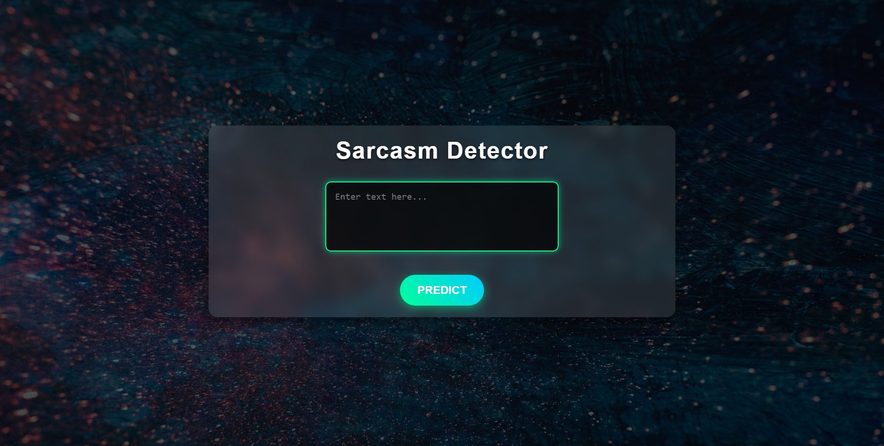
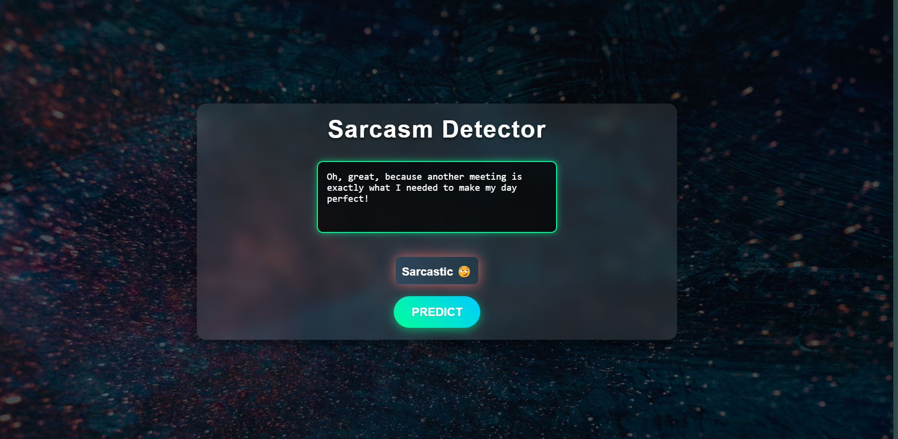
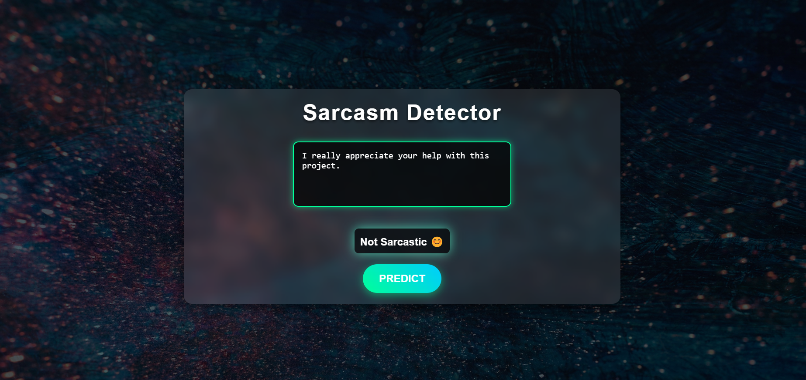

# Sarcasm Detection using BERT model - NLP Project



## Objective
The primary objective of this project is to develop a machine learning model capable of detecting sarcasm in textual data, specifically tweets. Sarcasm detection is a crucial task for enhancing the performance of sentiment analysis systems, enabling better understanding of social media dynamics, and improving human-computer interactions.

## Data Set
The project utilized several diverse datasets to ensure comprehensive sarcasm detection. The Sarcasm Headlines Dataset v1.0 and v2.0 provided labeled headlines as a baseline. The SPIRS dataset added diversity in sarcasm contexts with product reviews and social media posts. The Twitter US Airline Sentiment Dataset contributed a rich source of sarcastic and non-sarcastic tweets categorized by sentiment. The Sentiment140 dataset offered large-scale Twitter data labeled with sentiment polarity, enhancing model generalization. Finally, the Twitter News Dataset focused on sarcasm in news-related tweets, aiding in detecting domain-specific sarcasm.

All the datasets used in this can be found in [this link](https://drive.google.com/drive/folders/1NSXGPRQnuSP2ipNG6-I-7FF-tR9iZvVE)

## Methods
### 1. Data Preprocessing
Data preprocessing involved several steps to clean and standardize the text. Text was converted to lowercase, and common words (stopwords) were removed to retain meaningful content. Elements such as hashtags, mentions, and URLs were eliminated, along with unnecessary punctuation, emojis, and special characters. Stemming and lemmatization ensured word standardization. Custom regex was used for emoji and character removal. 
### 2. Model Architecture and Training
The BERT (Bidirectional Encoder Representations from Transformers) model, pre-trained on bert-base-uncased, was fine-tuned for binary classification. The tokenizer handled truncation and padding to ensure uniform input length. Training involved splitting the data into 90% training and 10% validation subsets, with a separate test dataset for evaluation. Training used batch sizes of 8, a learning rate scheduler, and the AdamW optimizer. Evaluation metrics included accuracy and F1 score, and the best model checkpoint was saved based on validation performance.
The fine-tuned BERT model achieved a validation accuracy of 0.8371 and an F1 score of 0.59, with the same metrics observed for the test dataset. Removal of hashtags and mentions significantly improved performance, while lemmatization proved more effective than stemming. The use of diverse preprocessing combinations optimized performance across datasets. The model was able to classify sarcastic tweets with high confidence while effectively handling ambiguities in edge cases.
## Conclusion
This project demonstrates the effectiveness of leveraging BERT for sarcasm detection on social media. Comprehensive preprocessing and data cleaning, combined with robust model fine-tuning, allowed us to achieve promising accuracy and F1 scores across diverse datasets. The insights and model developed here can be applied to other domains requiring nuanced text understanding, such as customer reviews and sentiment analysis.


## Setup and Running the Sarcasm Detector

Follow the steps below to set up and run the sarcasm detector on your local machine:

### Prerequisites

Before you begin, ensure you have the following installed:

1. **Python 3.8+**: You can download it from [python.org](https://www.python.org/).
2. **pip**: Python package manager (comes with Python installation).
3. **virtualenv** (optional but recommended): To isolate the project's dependencies.

### Setup and Running

1. **Clone the Repository**  
   Clone this repository to your local machine:
   ```bash
   git clone https://github.com/Orion777-cmd/sarcasm_detector.git
   cd sarcasm_detector

2. **Set Up a Virtual Environment (Optional but recommended)**
Create and activate a virtual environment:

```bash
python -m venv venv
source venv/bin/activate       # On macOS/Linux
venv\Scripts\activate          # On Windows
```

3. **Install Dependencies**
Install the required Python libraries:

```bash
pip install -r requirements.txt
```

4. **Run the Sarcasm Detector**
Start the sarcasm detection script to process inputs:

```bash
python main.py
```

## Snapshots of the model result




